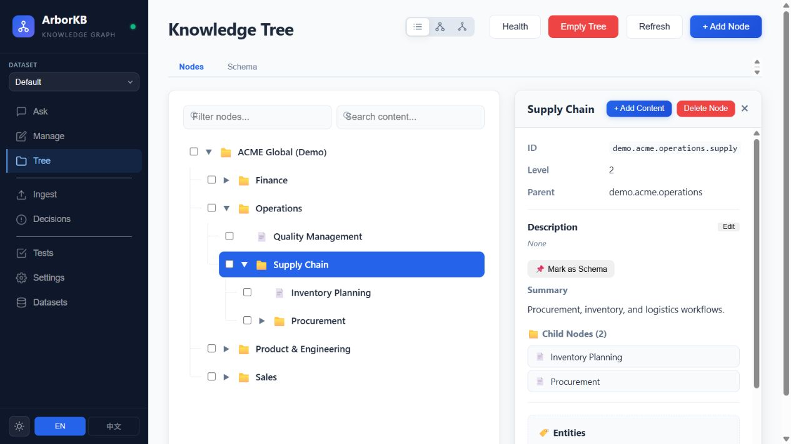
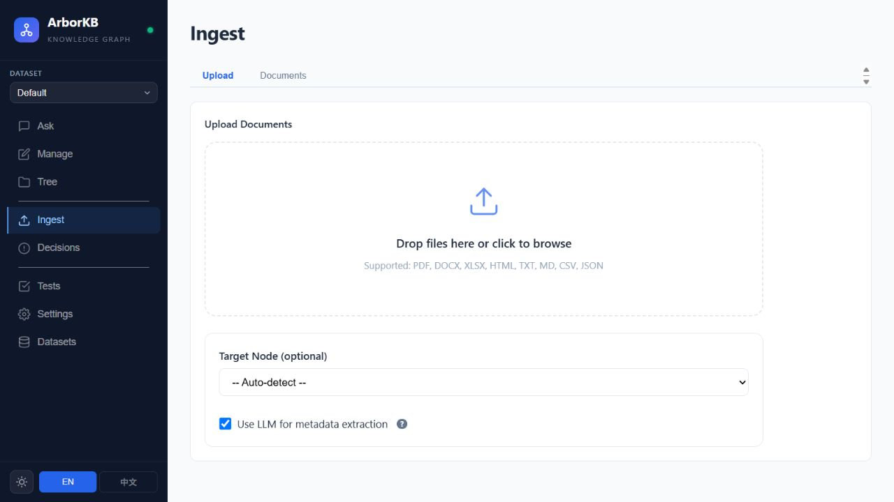
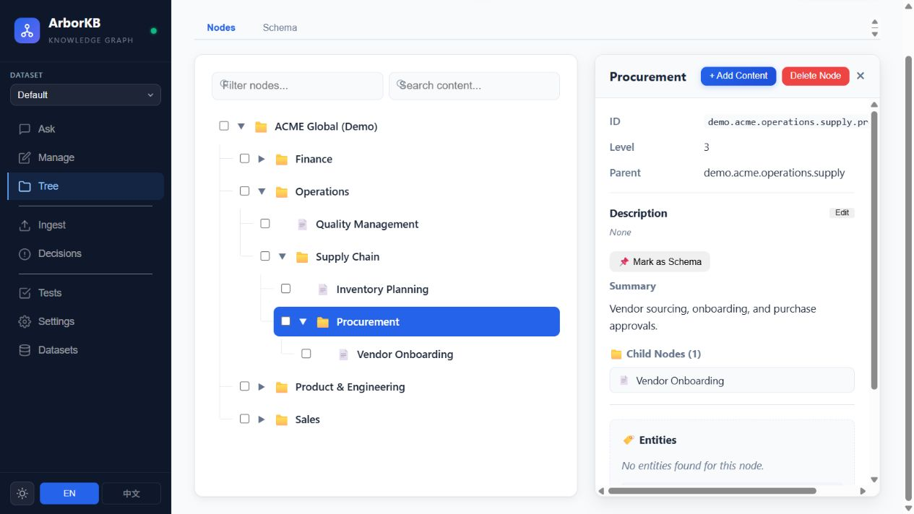

<div align="center">

# ArborKB

### Give your documents a structure you can explore.

Turn scattered material into a topic tree, ask questions, and follow the answer back to its sources.

**Knowledge trees** · **Source-linked answers** · **Separate local datasets**

[Why ArborKB](#find-the-context-behind-the-answer) · [Product tour](#product-tour) · [Try it locally](#try-it-locally)

</div>



*Actual local application with manually seeded fictional ACME demo nodes. This tour shows tree navigation; it does not represent AI ingestion or a generated answer.*

## Find the context behind the answer

A folder full of documents can be hard to navigate. Keyword search finds mentions, while a chatbot can leave you wondering where an answer came from.

ArborKB organizes extracted knowledge into a tree of topics. Browse the structure, inspect the underlying material, and ask questions with citations to the stored sources. It combines a visual knowledge workspace with AI-assisted document processing and retrieval.

## Product tour

### 1. Create a home for the material

Open **Datasets** to create or select a knowledge base. Each dataset has its own local SQLite database. Import a guided schema if you want a consistent starting taxonomy.

### 2. Bring in documents

Use **Ingest** to upload material and watch the background job progress. The parser accepts common text, office, spreadsheet, PDF, and HTML formats. AI extraction turns the material into knowledge points and maps them to the topic tree.

An accepted upload starts a job; wait for it to finish before expecting the new knowledge in answers.



*The intake screen is shown before uploading a document; no ingestion or provider call was run for this capture.*

### 3. Explore and refine the tree

Open **Tree**, move through related topics, and inspect the stored chunks behind a node. Edit or reparent a topic when the structure needs work. **Decisions** lets you review potential conflicts and replacements rather than silently treating them as settled knowledge.



### 4. Ask, inspect, and improve

Ask a question in **Ask**. Retrieval combines the hierarchy, full-text search, and optional vector embeddings to assemble supporting material. Review the citations and confidence signals alongside the answer.

Save representative questions in **Tests** and compare local runs after changing documents, prompts, or retrieval settings.

## A workspace for the whole knowledge lifecycle

- **Bring context together:** ingest multiple file types into a navigable topic structure.
- **See the organization:** inspect and adjust the hierarchy instead of treating retrieval as a black box.
- **Keep sources close:** follow stored material behind a node or answer.
- **Review change:** inspect conflicts, source chunks, and proposed replacements.
- **Keep projects separate:** switch among local datasets and their schemas.

## Try it locally

Requires Node.js, npm, a compatible `better-sqlite3` native build, and OpenAI or Gemini credentials for AI ingestion and answers.

```powershell
npm ci
Copy-Item .env.example .env
# Choose LLM_PROVIDER and set its provider key in .env.
npm start
```

Open [the local workspace](http://localhost:3000/). Create a dataset, ingest a small document, wait for completion, and ask a question. The tree interface can also display manually seeded demo nodes without an AI provider.

See the [development guide](docs/development.md) for configuration, supported inputs, API examples, and operational details.

## Where the project is today

ArborKB is a local application for a trusted single operator. It has no user login or per-user dataset authorization. Provider-backed processing may send document text outside the machine. Answers need source review; local benchmark reports do not establish general accuracy.

The screenshots were captured from the local `arborkb-v4` development working tree. Some uncommitted implementation changes are excluded from this documentation publication, so a GitHub checkout may differ from the captured interface. The pictured topics are manually seeded fictional demo nodes.

Learn more in the [guided schema manual](docs/GUIDED_SCHEMA_MANUAL.md), [document processing flow](docs/DOCUMENT_PROCESSING_FLOW.md), and [API reference](docs/openapi.yaml).
